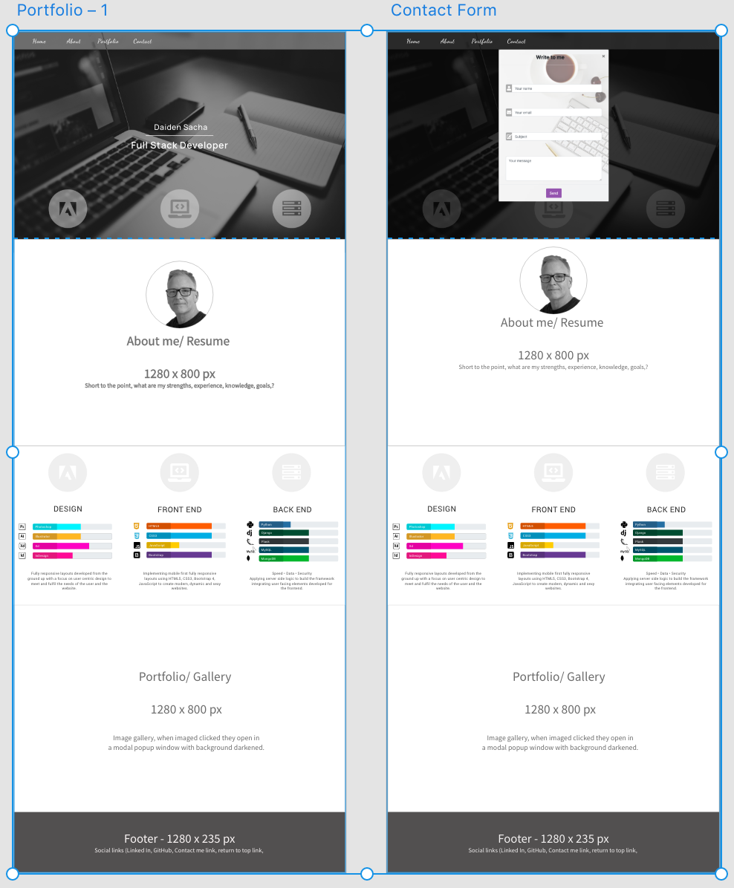

# Welcome
## Code Institute: Milestone Project 1 
### Portfolio - Daiden Sacha - Full Stack Web Developer
* * *
I decided on completing a personal portfolio because of my desire to change my career to Full Stack Development. This project motivated me to nosh out the details and to create a portfolio that will continue to evolve as my knowledge increases and my studies progress. [See my portfolio](https://daidensacha.github.io/Portfolio-Daiden-Sacha/).

### UX DESIGN
* * *
The initial planning for the project entailed working through the 5 planes of user experience. 

#### 1. Strategy

- External Users

    I identified 3 potential external users of interest for the site and the following user stories to develop an idea of what needs were to be fulfilled.
    1. Recruiters looking for someone to fill positions. 
        - As the recruiter, the first impression will be when I arrive at the portfolio landing page
        - As the recruiter, I want to know what your development skills are.
        - As the recruiter, I want to be able to download a CV
        - As the recruiter, I want to see examples of your work.
        - As the recruiter, I want to know who you are, what are your ethics, what motivates you.
        - As the recruiter, I want to be able to contact you.
    2.  Clients looking for freelancers to complete specified work.
        - As the hirer, I’m looking for quality work to be completed within a time frame and budget.
        - As the hirer, I want to see examples of your work
        - As the hirer, I want to know your development skills
        - I want to know what sort of guarantee you offer within the frame of the contract.
        - I want to know contact options, form/ phone.
    3.  Open source projects in need of contributors. 
        - As the project director, I need someone to be responsible for particular parts of development within the framework of a larger project.
        - As the project director, I’m looking for someone who can work within a team framework, in collaboration with others.
        - As the project director, I want someone with good communication skills and work ethic.
        - As the project director, I want someone reliable who can commit to completing agreed work within a given time frame. 
        - As the project director, I want to know your skills
        - As the project director, I want to see examples of work

- **Site Owner:** From my side, I'm looking for opportunities to work in an environment that supports personal and professional development, working with the latest technologies. I want to develop, I want to grow and I want to put myself out there to explore opportunities to work with other professionals in the web development field.

#### 2. Scope
With potential users in mind, my goal is to create a landing page with a good first impression, simple but clear. Goal: Keep it focussed on "promoting the professional me".

- **Required Features**

  - One page site, simple and not overcooked with info. 
  - Sticky navbar, there when it's needed. 
  - Icon links to Linkedin, Github, Codepen.
  - Modal contact form, easy to open, doesn't navigate away from the homepage.
  - About Me, Who am I, what's my strength or skillset, and what do I do/ offer? It should be a simple outline that someone can skim through to get a brief outline.
  - Resume, to view, and the possibility to download a PDF copy.
  - Skills block, with a simple overview of my skills, using icons and progress bars.
  - Portfolio gallery, an image gallery showing examples of my work.
  - Footer with a navbar and icon links to Linkedin, Github, Codepen.

- **Functional Requirements**
  - **Sticky Navbar** Navbar with links to page sections **About Me**, **Skills**, **Portfolio**, **Contact Form**, and icon links to **Github**, **Linkedin**, **Codepen**, and the **contact form**. Disappears when scrolling down page, appears when scrolling up.
  - **Offcanvas Navigation** Off-canvas menu becomes visible for small screens. 
  - **Smooth Navigation Scrolling** Utilising the "ToTop" feature for smooth scrolling when navigating to different page sections. 
  - **About Me** A section introducing myself, with a link to download my CV for more complete information.
  - **CV Download** User clicks on the link/ button to download my CV. It opens a readable version online and offers the opportunity to download a PDF.
  - **Skill block with progress bars** Skill block displaying individual skills with a progress bar that I can adjust to reflect my skill proficiency as it improves.
  - **Portfolio Gallery** A portfolio gallery, displaying images of websites. Each image opens a gallery of related images to view different aspects of the work. An overlay appears on hover of each image with the listed skills used to complete the site.
  - **Contact Form:** Easily accessible from any point on the webpage, the link in navbar or the contact icon opens a modal contact form. 

- **Content Requirements**
  - **Single Page site** - Containing blocks of information in sequential order of importance.
  - **Header - Landing Page** - Full-screen image with my name, profession, navbar links, and development icons **Adobe Design**, **Frontend Development**, **Backend Development**.
  - **About Me Section** - The info is to be simple and to the point, who I am, what I do, and what I offer. An introduction that is an easy read for someone interested in a glance at info about me. Link to be able to download and or print a CV.
  - **CV download** - An up to date CV to be made available from download in PDF format.
  - **Skill Block** A section with skill icons and progress bars split into sections for **Adobe Design**, **Frontend**, and **Backend**. 
  - **Portfolio Gallery** Screenshots of websites, there different pages and features in an easily accessible gallery format to display samples of my work. Short description of the site and work undertaken to complete the site.
 
**NOTE - Choice of the framework:**

***Bootstrap vs UIkit***
The first step. With an idea of what I needed to create, I went to [Codepen](https://codepen.io/daidensacha) to play. 
- [ ] Modal form
- [ ] Skills block
- [ ] Portfolio gallery

I wanted to get an idea of what I could do with ***Bootstrap***. After creating the Modal Form and Skills block without problems, I realized I was limited to Bootstrap gallery options that did not meet my liking/ needs.

I started over again creating the same prototypes with ***UIkit***, as I felt it offered more by way of options that suited my needs. It became my preferred option as I could use it to create all required features, including the Portfolio Gallery. Class names are a little different but it is open source and very similar to the Bootstrap Framework.

#### 3. Structure
- **Interaction Design** 
    -    Bearing in mind that when you introduce yourself to someone they don't always want to know everything, but might be interested in viewing a brief outline, enough to decide if there is interest in downloading a CV. To this end, the site is designed to be minimalistic, with options to contact or download my CV for more information. 

    - The contact form is available easily at any point in browsing the site and opens in a modal so as not to navigate away from the homepage. 

    - Same with the CV, a download link in the "About me" section opens the PDF in a separate tab for downloading or printing.

    - A portfolio has one image of each site as a teaser, that opens to a slideshow in a modal lightbox, easily closed to return to the homepage.

- **Information Architecture** Information arranged in the following order.
    - ***Homepage/ Landing page:*** First impressions count. Simple and elegant page with full-screen image, name, profession, sticky navigation, and social links. Clean, structured, and professional is the message.
    - ***About Me*** Scrolling down the first block is an introduction to who I am, what I do, and what I offer. 
    - ***CV*** Link in the "About me" section to view and/or download my CV. The goal is to provide an easily readable bio, enough to entice further interest.
    - ***Skills Section*** Split into categories "Adobe Design", "Frontend Development" and "Backend Development", with skills displayed including icons, and progress bars. Fits the site for now, but as I increase my knowledge and add to my skill and tools, I would redesign this section to better display all the tools I can work with.
    - ***Portfolio Gallery*** Visual and informative section displaying my work. 
    - ***Contact Form*** One click opens the contact form in a modal available easily at any point in browsing the site. 

#### 4. Skeleton
- ***Wireframing:*** My first venture into wireframing, and my choice was to go with Adobe XD. Ample information and tutorials online to learn the user interface. I was able to knock up a prototype of the site and to establish some fonts and colors to be used on the site. 

#### 5. Surface
***Visual Design:*** Kept the site to black and white with different shades and a touch of color in the icons and buttons, and the progress bars. I also dressed up the background of the "Portfolio" section using a blue textured background. Skill category icons were designed and created in Adobe Illustrator, images of myself edited and created in Adobe Photoshop. The home screen image is a free stock image, also edited in Adobe Photoshop.

### TECHNOLOGIES USED
***

***Languages Used***
1. HTML5
2. CSS3
3. SCSS
4. Markdown

***Frameworks, Libraries, Programs used*** 
1. [UIkit 3.4.6](https://getuikit.com)
    - My preferred responsive framework developing with all screen sizes in mind. Included Modal windows for the contact form, also for displaying my CV. Sticky navbar used for the main navbar, and off-canvas nav for small screens. Image gallery created using a modal lightbox gallery.
2. [Pure CSS3 Animated Border](https://code-fx.github.io/Pure-CSS3-Animated-Border/)
    - Used for the main navbar underline effect.
3. [jQuery 3.5.1](https://jquery.com)
    - Required dependency for use with UIkit.
4. [FontAwesome](https://fontawesome.com)
    - Icons used for the social links, GitHub, Linkedin, Codepen.
5. [Google Fonts](https://fonts.google.com)
    - My chosen font for use throughout the project, "Manrope".
6. [GitHub](https://github.com)
    - Used to host my repository for the project, and finished project deployed to GitHub Pages.
7. [Git Version Control](https://git-scm.com) 
    - Regular backups and commits using Git, pushing my work to the repository on GitHub.
8. [Adobe Xd](https://www.adobe.com/uk/products/xd.html)
    - Used Adobe Xd to create my wireframe and initial prototype for the site. 
9. [Adobe Photoshop](https://www.adobe.com/uk/products/photoshop.html)
    - Used Photoshop to edit images, and add effects to images.
10. [Adobe Illustrator](https://www.adobe.com/uk/products/illustrator.html)
    - Used Illustrator to create icons and sprites, also my initial draft for my CV which was then saved to PDF.
11. [Adobe Premiere Pro](https://www.adobe.com/uk/products/premiere.html)
    - Used to edit, convert, and compress the short movie of the foot charts.
12. [Squoosh](https://squoosh.app)
    - Used Squoosh to compress images to cut the size for web deployment.
13. [Visual Studio Code](https://code.visualstudio.com)
    - I chose to use Visual Studio Code for the learning experience.
14. [Joplin](https://joplinapp.org)
    - A free open-source note-taking and markdown application, for OSX, iOS, Linux, Windows. Used to create and work on my README file.
    
***TECHNOLOGY NOTES:***

**Visual Studio Code:** This project was an expansive learning experience in many ways. I've used TextMate, Sublime Text, and Atom, and I have been looking for a good IDE editor to use moving forward. Having used GitPod in the introduction to this course, this project offered the opportunity to get to know Visual Studio Code. It's been a good experience, and overall I am really happy with it. The terminal interface gives easy access to the project root, making it easy to use terminal to create directories and files. In the Mac, opening terminal with keys (⌃⇧\`) Control+Shift+Backtick is convenient. It gives instant access to Git Version Control to add changes, commit and push changes to the remote repository. 

**SCSS/CSS:** Having created the initial build in HTML and CSS, I implemented CSS variables to make it easier to make changes to the skill icon block when needed. Specifically the progress percentage display. There were conflicts with image paths in Safari and Chrome browsers. CSS variables did not work for me. Rather than let it go, I looked into Less, SASS, and SCSS. After researching, I concluded that SCSS is presently the most attractive option, and in high demand as a skill in advertised jobs. The [SASS Website](https://sass-lang.com/install) gives clear and easy instructions to install. I chose to install Dart Sass using the Homebrew Package manager. `brew install sass/sass/sass`.  Compiling on the command line is easy at any time by writing the source file path and target file paths, `sass file-path/style.scss file-path/style.css`. Even easier is live compiling upon saving the SCSS file by typing, `sass --watch assets/scss/style.scss assets/css/style.css`. Exiting the live compiling process is easy by hitting Control+C on a Mac. 
I rewrote my CSS, nesting selectors and styles where possible to save duplication. I recognise I still have much to learn but it's good to jump into it. I was able to create variables without any issues, which enables me to go back to make changes to the percentage bars at any time, with ease.

### TESTING
* * *

Initial features/ modules of the site were created locally and in Codepen to test and compare the advantages and disadvantages of Bootstrap and UIkit frameworks. My goal was to see what was possible and which framework best suited my needs for this project. In the end, my preference was UIkit. It was easily added into the project in terminal using `yarn add UIkit`. 

In Visual Studio Code I had the option to view in the live server as I worked, and also to view in the browser for when I wanted to use the web inspector to identify the source of errors, or to identify selectors for customising CSS styling. 

I tested the site using both Google Chrome, Safari on my Macbook Pro, and in Windows 10. In Chrome I was able to test the responsiveness of various screen sizes and devices from desktops, laptops, and mobile devices. Once the site was uploaded and live on GitHub, I was able to test it by sending links to friends and colleagues to get feedback. 

***Testing Notes*** 

- My focus during development was that the site viewed equally well in my 15" Macbook Pro, and also on smaller screens. The Navbar which contained the main navigation to the left, and the social navigation to the right did not fit on small screens, so I implemented the off-canvas menu. The social navigation remains visible for small screens, and main navigation links are available in the off-canvas menu. 
- In my original wireframe, I had envisaged a single image framed in a circle but on larger screens, there was too much white space, so I created a separate image for large screens, and the image framed in a circle works nicely on smaller screens. I had some initial issues with margins in the skill block with the three columns, noticeable when they stacked on smaller screens, however, it was sorted by adding `uk-collapse` class to the grid. 
- I verified that users of interest can easily contact me by clicking on the contact link in the navbar, or the contact icon also in the navbar and in the footer. When clicked the modal opens with the contact form. 
- Potential users can also view and download my CV by clicking on the button in the "About me" section. When clicking the button, a modal opens displaying the CV, with another button inviting the user to download the CV. When clicked it opens the CV PDF in a separate browser tab.
- The sections are easy to navigate when clicking on the section links in the navbar. The scrolling is smooth. 
- I verified that interested users can view samples of my work by navigating to the Portfolio Gallery. I provided a sample of 5 separate projects, each including up to 12 screenshots of my previous works. When the mouse hovers over the displayed image an overlay appears displaying the skills used to create the work. Clicking on the image opens a lightbox slideshow that auto-plays. The displayed sites are grouped in sets of images that can be opened separately.
- For interested users who what to know more about me, I provided icon links to my GitHub, Linkedin, and Codepen. When clicking on the links, the sites are opened in separate tabs. 

Evaluating the final product with the initial user stories in mind, my goal was to keep it simple, to the point, and to portray a professional image. My conclusion is that the initial impression becomes the foundation for further interest. From the landing page, users are guided through scrolling the page to the about me section, with a link to view, and or download my CV. Next, my skills are displayed using various modes of presentation. The code icons, progress bars, and colors, and then the portfolio gallery. I think I addressed the key points of interest in the initial user stories.

- [W3C HTML Validation](https://validator.w3.org/nu/): No real issues passing W3C HTML validation.
- [W3C CSS3 Validation](https://jigsaw.w3.org/css-validator/): No issues at all passing the W3C CSS3 validation.

### DEPLOYMENT
* * *

#### **Creating the repository and cloning to Visual Studio Code**

1.  On GitHub.

    -   I used the Code Institute [gitpod-full-template](https://github.com/Code-Institute-Org/gitpod-full-template) to start my project.

    -   I clicked on “Use this template”, which opened a window prompting me to name my repository. 

    -   I named it “Portfolio-Daiden-Sacha” and clicked “Create repository from template”.

    -   On the repository page, I clicked “Clone or download” and copied the Web URL for the repository.

2.  In Visual Studio Code

    -   I navigated to File > New Window

    -   In the activity bar on the left, I clicked “Source Control”.

    -   I clicked “Clone Repository"

    -   I pasted the repository URL into the field prompting me for the repository name and hit enter.

    -   It prompted me to choose a location to save the project, which I did and saved it.

    -   The cloning was complete, showing the files in the sidebar.

**Creating the directories and files in terminal in Visual Studio Code**

1.  Open terminal in Visual Studio Code using shortcut keys on mac: Control + Shift + `

2.  Create directories in one line in terminal by writing: `mkdir assets assets/css assets/scss assets/js assets/images assets/images/gallery-images assets/images/sprites assets/documents`

3.  Create all required files for site in terminal by writing: `touch index.html assets/css/style.css assets/scss/style.scss assets/scss/variables.scss assets/js/main.js`

**Git initial commit**

1.  Check for new changes to be added to the repository: `git status`

2.  Add changes to be committed: `git add .`

3.  Commit new directories and files to the repository: `git commit -m “Initial commit, created directories and files"`

4.  Push the changes to the remote repository hosted on Github: `git push`

**Deployment of the site to GitHub Pages**

1.  Once I was happy with my site, and had pushed the final changes to GitHub I navigated to the GitHub repository.

2.  On the GitHub repository page, I clicked on “Settings”.

3.  I scrolled down the page to the "GitHub Pages” section.

4.  I clicked on the dropdown and selected “master branch"

5.  The site is now live, showing “ Your site is published at <https://daidensacha.github.io/Portfolio-Daiden-Sacha/">

### CREDITS
* * *

- Inspiration for the hr divider was found in [Codepen - Divider Experiments #1](https://codepen.io/Oddgson/pen/VPrYbv). I changed it slightly added a rhombus shape in the middle of the hr. 

- Main Navbar link hover bottom-leftToRight Border taken from [Pure CSS3 Animated Border](https://code-fx.github.io/Pure-CSS3-Animated-Border/)

- Inspiration for the button and icon styling from ["Styling buttons, the right way"](https://fvsch.com/styling-buttons/) by **Florens Verschelde** 
- Thanks to UIkit for extensive documentation and examples showing what is possible and how to implement UIkit components and features used throughout my project.

### NOTES
* * *
- The form is not complete as I haven't learned how to process the data for sending. I would like to fix this in the next part of the course when we dive into JS.
- Also, although the skill block was fun to knock up, I'm not overly happy with it. As it is, I think it's limited, and a little too busy for my liking. Additionally, when I add tools that I plan to learn to what I already know, then a redesign of the skill block will be necessary.
- Apart from a few minor changes in the site, the build was as I envisaged when creating the wireframe. I chose not to use a handwritten font in the navbar as I felt it just didn't fit with the site. Secondly, I chose to create a different image for display in the about me section on screens bigger than a tablet.
